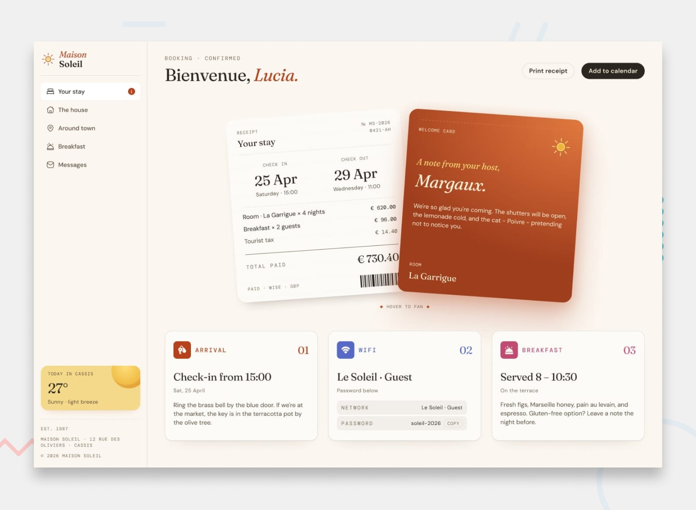

# Frontend Mentor - Hotel booking confirmation page



## Welcome! 👋

Thanks  checking out this coding challenge.

[Frontend Mentor](https://www.frontendmentor.io) challenges help you improve your coding skills by building realistic projects.

**To do this challenge, you need a good understanding of HTML and CSS.** A little JavaScript is optional for the interactive touches, like opening the navigation menu and copying the Wi-Fi password.

## The challenge

Build a hotel booking confirmation page and get it looking as close to the design as possible.

The page pairs a branded sidebar with a stack of overlapping cards: a printed-style receipt, a warm note from the host, and a row of arrival, Wi-Fi, and breakfast details. The layered cards, the mix of serif, sans-serif, and monospace type, and the responsive behavior are where most of the work is.

You can use any tools you like to help you complete the challenge. So if you've got something you'd like to practice, feel free to give it a go.

Your users should be able to:

- View the optimal layout for the interface depending on their device's screen size
- See hover and focus states for all interactive elements on the page
- Open and close the navigation menu on smaller screens (optional JavaScript)
- Copy the Wi-Fi password to their clipboard using the copy button (optional JavaScript)

## Ideas to test yourself

The design gives you plenty to build. If you want to push further, here are some optional extensions to try:

- Add a working copy button so guests can copy the Wi-Fi password in one click
- Make the sidebar navigation collapse into a toggleable menu on smaller screens
- Animate the receipt and host-note cards so they fan out on hover
- Wire up the "Print receipt" button to open a clean print view using the browser's print dialog
- Generate an "Add to calendar" file from the stay dates so guests can save their booking
- Load the booking details from a JSON file instead of hardcoding them

## Getting started

### What's included

Your task is to build out the project to the designs inside the `/design` folder. You'll find a mobile and a desktop version of the design, plus the open navigation menu and the hover and focus states.

In your download:

- Mobile and desktop designs (JPG format)
- All required assets in the `/assets` folder
- Variable and static font files (or link to Google Fonts)
- `style-guide.md` with colors, fonts, and other design specs

**Want more accurate builds?** The designs are in JPG static format, which means you'll need to use your best judgment for styles such as `font-size`, `padding`, and `margin`. If you'd like the Figma design file to help build a more accurate solution faster, you can [subscribe as a PRO member](https://www.frontendmentor.io/pro).

## Using AI coding assistants

We've included two files to help you if you're using AI coding assistants (like Claude, GitHub Copilot, Cursor, etc.) while working on this challenge:

- `AGENTS.md` - Contains detailed instructions for AI assistants on how to help you with this challenge. It's tailored to this challenge's difficulty level, so the AI will provide guidance appropriate to your learning stage—offering more support for beginner challenges and encouraging more independence on advanced ones.
- `CLAUDE.md` - A pointer file that directs Claude-based tools to the AGENTS.md instructions.

**How to use them:** You don't need to do anything! These files are automatically detected by most AI coding tools. The AI will read them and adjust its behavior to be a better learning partner—guiding you toward solutions rather than just giving you the answers.

**Note:** These files are designed to help you *learn*, not to do the work for you. The AI is instructed to ask questions, give hints, and explain concepts rather than writing complete solutions.

## Building your project

Feel free to use any workflow that you feel comfortable with. Below is a suggested process, but do not feel like you need to follow these steps:

1. Initialize your project as a public repository on [GitHub](https://github.com/). Creating a repo will make it easier to share your code with the community if you need help. If you're not sure how to do this, [have a read-through of this Try Git resource](https://try.github.io/).
2. Configure your repository to publish your code to a web address. This will also be useful if you need some help during a challenge as you can share the URL for your project with your repo URL. There are a number of ways to do this, and we provide some recommendations below.
3. Look through the designs to start planning out how you'll tackle the project. This step is crucial to help you think ahead for CSS classes to create reusable styles.
4. Before adding any styles, structure your content with HTML. Writing your HTML first can help focus your attention on creating well-structured content.
5. Write out the base styles for your project, including general content styles, such as `font-family` and `font-size`.
6. Start adding styles to the top of the page and work down. Only move on to the next section once you're happy you've completed the area you're working on.

### Want some support on the challenge?

[Join our community](https://www.frontendmentor.io/community) and ask questions in the **#help** channel.

## Deploying your project

As mentioned above, there are many ways to host your project for free. Our recommended hosts are:

- [GitHub Pages](https://pages.github.com/)
- [Vercel](https://vercel.com/)
- [Netlify](https://www.netlify.com/)

You can host your site using one of these solutions or any of our other trusted providers. [Read more about our recommended and trusted hosts](https://www.frontendmentor.io/guides/hosting-your-solution).

## Submitting your solution

Submit your solution on the platform for the rest of the community to see. Follow our ["Complete guide to submitting solutions"](https://www.frontendmentor.io/guides/how-to-submit-solutions) for tips on how to do this.

Remember, if you're looking for feedback on your solution, be sure to ask questions when submitting it. The more specific and detailed you are with your questions, the higher the chance you'll get valuable feedback from the community.

**We strongly recommend overwriting this `README.md` with a custom one.** We've provided a template inside the [`README-template.md`](./README-template.md) file in this starter code. The template provides a guide for what to add. A custom `README` will help you explain your project and reflect on your learnings.

## Sharing your solution

There are multiple places you can share your solution:

1. Submit it on the platform and share your solution page in the **#finished-projects** channel of our [community](https://www.frontendmentor.io/community)
2. Share on [X (formerly Twitter)](https://x.com/frontendmentor) and mention **@frontendmentor**, including the repo and live URLs in your post. We'd love to take a look at what you've built and help share it around.
3. Share your solution on [LinkedIn](https://www.linkedin.com/company/frontend-mentor/).
4. Blog about your experience building your project. Writing about your workflow, technical choices, and talking through your code is a brilliant way to reinforce what you've learned. Great platforms to write on are [dev.to](https://dev.to/), [Hashnode](https://hashnode.com/), and [CodeNewbie](https://community.codenewbie.org/).

## Got feedback for us?

We love receiving feedback! We're always looking to improve our challenges and our platform. So if you have anything you'd like to mention, please email hi[at]frontendmentor[dot]io.

**This challenge is completely free. Please share it with anyone who will find it useful for practice.**

**Have fun building!** 🚀


# TEMPLATE
# Frontend Mentor - Hotel booking confirmation page solution

This is a solution to the [Hotel booking confirmation page challenge on Frontend Mentor](https://www.frontendmentor.io/challenges/hotel-booking-confirmation-page). Frontend Mentor challenges help you improve your coding skills by building realistic projects. 

## Table of contents

- [Overview](#overview)
  - [The challenge](#the-challenge)
  - [Screenshot](#screenshot)
  - [Links](#links)
- [My process](#my-process)
  - [Built with](#built-with)
  - [What I learned](#what-i-learned)
  - [Continued development](#continued-development)
  - [Useful resources](#useful-resources)
  - [AI Collaboration](#ai-collaboration)
- [Author](#author)
- [Acknowledgments](#acknowledgments)

**Note: Delete this note and update the table of contents based on what sections you keep.**

## Overview

### The challenge

Users should be able to:

- View the optimal layout for the interface depending on their device's screen size
- See hover and focus states for all interactive elements on the page
- Open and close the navigation menu on smaller screens (optional JavaScript)
- Copy the Wi-Fi password to their clipboard using the copy button (optional JavaScript)

### Screenshot


Add a screenshot of your solution. The easiest way to do this is to use Firefox to view your project, right-click the page and select "Take a Screenshot". You can choose either a full-height screenshot or a cropped one based on how long the page is. If it's very long, it might be best to crop it.

Alternatively, you can use a tool like [FireShot](https://getfireshot.com/) to take the screenshot. FireShot has a free option, so you don't need to purchase it. 

Then crop/optimize/edit your image however you like, add it to your project, and update the file path in the image above.

**Note: Delete this note and the paragraphs above when you add your screenshot. If you prefer not to add a screenshot, feel free to remove this entire section.**

### Links

- Solution URL: [Add solution URL here](https://your-solution-url.com)
- Live Site URL: [Add live site URL here](https://your-live-site-url.com)

## My process

### Built with

- Semantic HTML5 markup
- CSS custom properties
- Flexbox
- CSS Grid
- Mobile-first workflow
- [React](https://reactjs.org/) - JS library
- [Next.js](https://nextjs.org/) - React framework
- [Styled Components](https://styled-components.com/) - For styles

**Note: These are just examples. Delete this note and replace the list above with your own choices**

### What I learned

Use this section to recap over some of your major learnings while working through this project. Writing these out and providing code samples of areas you want to highlight is a great way to reinforce your own knowledge.

To see how you can add code snippets, see below:

```html
<h1>Some HTML code I'm proud of</h1>
```
```css
.proud-of-this-css {
  color: papayawhip;
}
```
```js
const proudOfThisFunc = () => {
  console.log('🎉')
}
```

If you want more help with writing markdown, we'd recommend checking out [The Markdown Guide](https://www.markdownguide.org/) to learn more.

**Note: Delete this note and the content within this section and replace with your own learnings.**

### Continued development

Use this section to outline areas that you want to continue focusing on in future projects. These could be concepts you're still not completely comfortable with or techniques you found useful that you want to refine and perfect.

**Note: Delete this note and the content within this section and replace with your own plans for continued development.**

### Useful resources

- [Example resource 1](https://www.example.com) - This helped me for XYZ reason. I really liked this pattern and will use it going forward.
- [Example resource 2](https://www.example.com) - This is an amazing article which helped me finally understand XYZ. I'd recommend it to anyone still learning this concept.

**Note: Delete this note and replace the list above with resources that helped you during the challenge. These could come in handy for anyone viewing your solution or for yourself when you look back on this project in the future.**

### AI Collaboration

Describe how you used AI tools (if any) during this project. This helps demonstrate your ability to work effectively with AI assistants.

- What tools did you use (e.g., ChatGPT, Claude, GitHub Copilot)?
- How did you use them (e.g., debugging, generating boilerplate, brainstorming solutions)?
- What worked well? What didn't?

**Note: Delete this note and the content above if you didn't use AI, or replace with your own experience.**

## Author

- Website - [Add your name here](https://www.your-site.com)
- Frontend Mentor - [@yourusername](https://www.frontendmentor.io/profile/yourusername)
- Twitter - [@yourusername](https://www.twitter.com/yourusername)

**Note: Delete this note and add/remove/edit lines above based on what links you'd like to share.**

## Acknowledgments

This is where you can give a hat tip to anyone who helped you out on this project. Perhaps you worked in a team or got some inspiration from someone else's solution. This is the perfect place to give them some credit.

**Note: Delete this note and edit this section's content as necessary. If you completed this challenge by yourself, feel free to delete this section entirely.**
